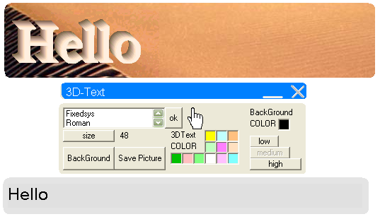



## three dimensional text

### Description

my code converts two dimensional text into three dimensional text.
 
### More Info
 
two dimensional text.

no Explanation,no Assumptions,no Misc

three dimensional text.

no side effects.

             |
---                |---
**Submitted On**   |2005-02-21 08:25:36
**By**             |[saeed sheikholeslami](https://github.com/Planet-Source-Code/PSCIndex/blob/master/ByAuthor/saeed-sheikholeslami.md)
**Level**          |Beginner
**User Rating**    |5.0 (35 globes from 7 users)
**Compatibility**  |VB 6\.0
**Category**       |[Graphics](https://github.com/Planet-Source-Code/PSCIndex/blob/master/ByCategory/graphics__1-46.md)
**World**          |[Visual Basic](https://github.com/Planet-Source-Code/PSCIndex/blob/master/ByWorld/visual-basic.md)
**Archive File**   |[three\_dime1856402222005\.zip](https://github.com/Planet-Source-Code/saeed-sheikholeslami-three-dimensional-text__1-59094/archive/master.zip)

